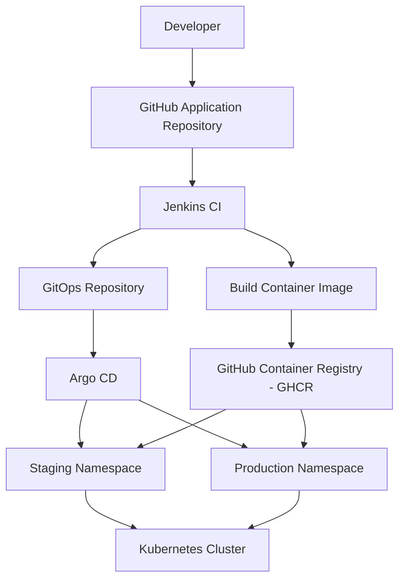

# Production DevOps GitOps Platform

A production-style CI/CD and GitOps project demonstrating automated
container builds, immutable image versioning, environment separation,
controlled promotion, and Kubernetes deployment using Jenkins, GHCR,
Argo CD, and Kubernetes.

## Architecture

Application Code
      |
      v
   Jenkins
      |
      v
Docker Build
      |
      v
GitHub Container Registry (GHCR)
      |
      v
GitOps Repository
      |
      v
    Argo CD
      |
      v
  Kubernetes
   /      \
Staging  Production

## Technology Stack

- Linux / Ubuntu Server
- Git & GitHub
- Docker
- Jenkins
- GitHub Container Registry (GHCR)
- Kubernetes
- Argo CD
- YAML

## Repository Structure

production-devops-gitops/
├── apps/
│   ├── staging-app/
│   │   ├── deployment.yaml
│   │   └── service.yaml
│   │
│   └── production-app/
│       ├── deployment.yaml
│       └── service.yaml
│
├── argocd/
│   ├── staging-application.yaml
│   ├── production-application.yaml
│   └── production-app.yaml
│
└── README.md

## CI/CD and GitOps Workflow

### 1. Continuous Integration

Jenkins builds the application as a Docker image.

Each build receives a specific immutable image tag instead of using
`:latest`.

Example:

ghcr.io/ekerette0852/production-devops-platform:06c2685

The image is pushed to GitHub Container Registry.

### 2. Staging Deployment

The staging Kubernetes manifest is updated with the new image version.

The change is committed to Git.

Argo CD detects the desired-state change and automatically reconciles
the staging Kubernetes environment.

The staging deployment is then verified before production promotion.

### 3. Controlled Production Promotion

Production is not automatically updated when staging receives a new
version.

After staging verification, the exact tested image version is promoted
by updating:

apps/production-app/deployment.yaml

The change is committed and pushed to Git.

Argo CD detects the production change and reconciles the production
environment.

This ensures that the same tested artifact is promoted from staging
into production.

## Environment Separation

The project maintains independent Kubernetes namespaces:

- staging
- production

Each environment has its own Deployment and Service resources.

This allows a new application version to run in staging while
production continues running the previous stable version.

Example promotion:

Staging:
06c2685

Production before promotion:
3a720f3

Production after verification and promotion:
06c2685

## Git as the Source of Truth

Application deployments are managed declaratively through Git.

Production changes are not performed using commands such as:

kubectl set image

Instead, the Kubernetes manifests stored in Git define the desired
state.

Argo CD continuously compares the Git state with the Kubernetes
cluster and reconciles differences.

## Deployment Verification

Argo CD application health:

kubectl get application staging-web production-web -n argocd

Expected:

NAME             SYNC STATUS   HEALTH STATUS
staging-web      Synced        Healthy
production-web   Synced        Healthy

Verify staging:

kubectl get pods -n staging

Verify production:

kubectl get pods -n production

Verify deployed image:

kubectl get deployment production-web -n production \
-o jsonpath='{.spec.template.spec.containers[0].image}{"\n"}'

## Rollback Strategy

Because image versions are immutable and deployment state is stored
in Git, rollback can be performed by reverting the production manifest
to a previously known-good image version.

For example:

06c2685 -> 3a720f3

The rollback is committed and pushed to Git.

Argo CD then reconciles Kubernetes back to the previous desired state.

This preserves Git as the authoritative deployment history.

## Key DevOps Concepts Demonstrated

- Continuous Integration
- Continuous Delivery
- GitOps
- Infrastructure as Code principles
- Kubernetes deployments
- Environment isolation
- Immutable container images
- Image version pinning
- Artifact promotion
- Declarative configuration
- Automated reconciliation
- Production rollback
- Deployment verification

## Project Outcome

Successfully implemented a production-style deployment workflow where:

1. Jenkins builds a versioned container image.
2. GHCR stores the immutable artifact.
3. The new version is deployed to staging first.
4. Staging is verified before production promotion.
5. The same tested image is promoted to production.
6. Argo CD reconciles both environments from Git.
7. Kubernetes performs the application rollout.
8. Both staging and production reach Synced and Healthy state.

The project demonstrates separation between CI and CD while keeping
Git as the source of truth for Kubernetes deployments.
